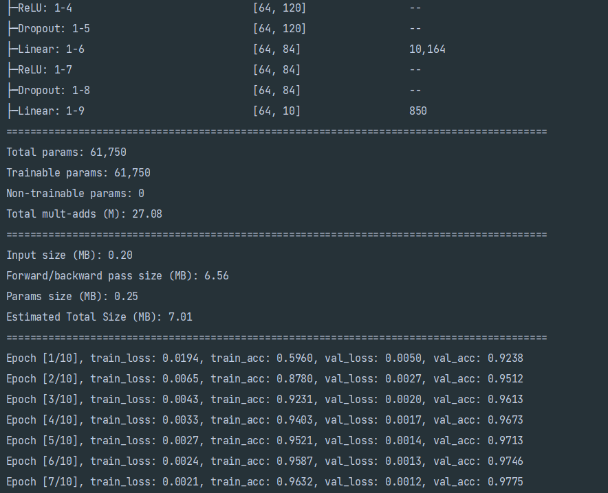
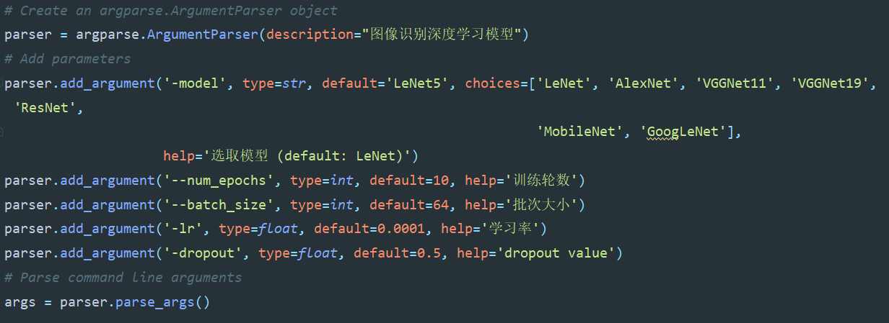

如何运行文件？

以 LeNet 为例

输入命令

```
python cnn.py -model LeNet --num_epochs 10 --batch_size 64 -lr 0.0001 -dropout 0.5 
```

点击回车即可运行。

你可以看到 torchvision.summary 输出的网络结构 summary，和每个 epoch 运行时的训练集损失、训练集准确率、验证集损失、验证集准确率。



各个参数的含义：



cuda 版本：12.1